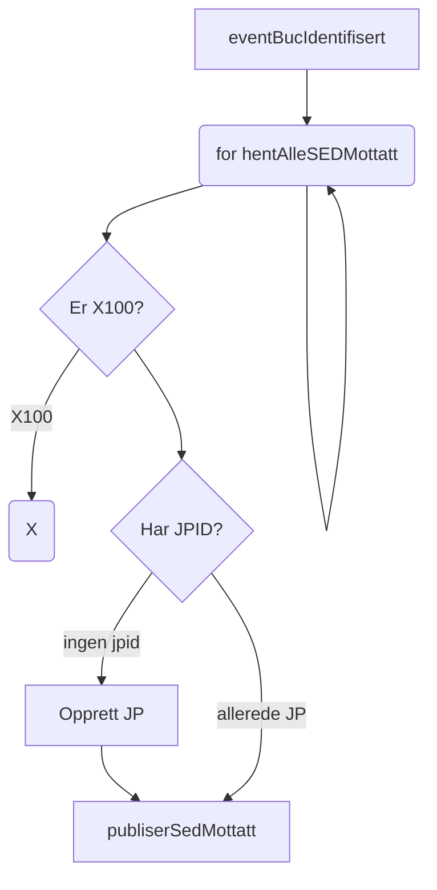

```mermaid
flowchart
    eventBucIdentifisert --> forHentAlleSedMottatt(for hentAlleSEDMottatt)
    forHentAlleSedMottatt --> forHentAlleSedMottatt
    forHentAlleSedMottatt --> sedIdentifisertType{Er X100?}

    sedIdentifisertType --> |X100| sedIdentifisertErX100(X)
    sedIdentifisertType --> harJpid{Har JPID?}

    harJpid --> |ingen jpid| opprettJp[Opprett JP]
    opprettJp --> publiserSedMottatt
    harJpid --> |allerede JP| publiserSedMottatt
```

