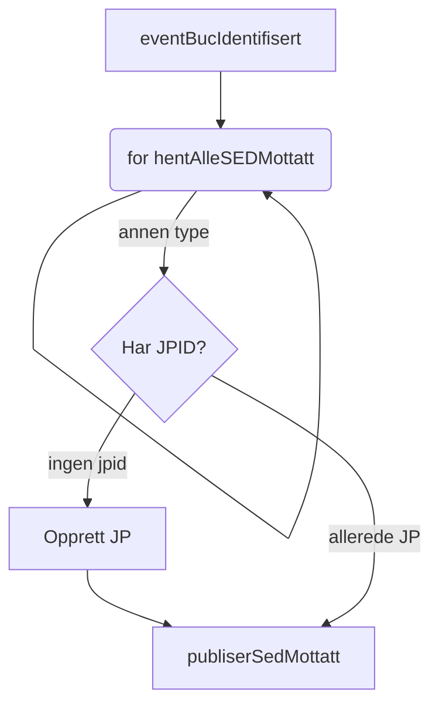

# BUC Identifisert

```mermaid
flowchart
    eventBucIdentifisert --> forHentAlleSedMottatt(for hentAlleSEDMottatt)
    forHentAlleSedMottatt --> forHentAlleSedMottatt
    forHentAlleSedMottatt --annen type--> harJpid{Har JPID?}

    harJpid --ingen jpid--> opprettJp[Opprett JP]
    opprettJp --> publiserSedMottatt
    harJpid --allerede JP--> publiserSedMottatt
```

