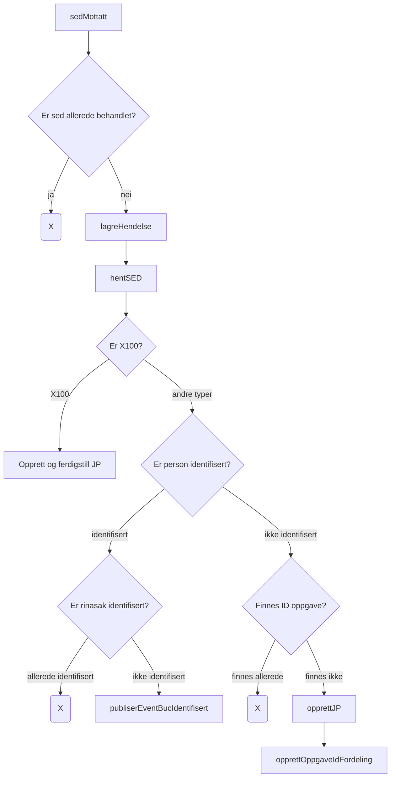

# SED Mottak

```mermaid
flowchart
    sedMottatt --> sedAlleredeBehandlet{Er sed allerede behandlet?}
    sedAlleredeBehandlet --ja--> allederedeBehandlet(X)
    sedAlleredeBehandlet --nei--> lagreHendelse

    lagreHendelse --> hentSED
    hentSED --> sedType{Er X100?}
    sedType --X100--> sedErX100[Opprett og ferdigstill JP]
    sedType --andre typer--> identifiserPerson{Er person identifisert?}

    identifiserPerson -- identifisert --> erRinasakIdentifisert{Er rinasak identifisert?}
    erRinasakIdentifisert --allerede identifisert--> rinasakIdentifisert(X)
    erRinasakIdentifisert --ikke identifisert--> publiserEventBucIdentifisert

    identifiserPerson --ikke identifisert--> finnesOppgaveAllerede{Finnes ID oppgave?}
    finnesOppgaveAllerede --finnes allerede--> oppgaveFinnesAllerede(X)
    finnesOppgaveAllerede --finnes ikke--> opprettJP
    opprettJP --> opprettOppgaveIdFordeling
```

