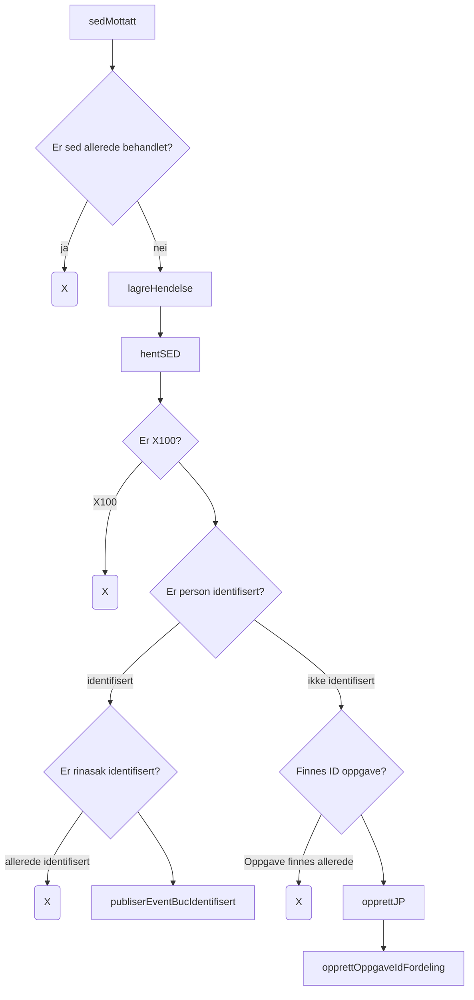

```mermaid
flowchart
    sedMottatt --> sedAlleredeBehandlet{Er sed allerede behandlet?}
    sedAlleredeBehandlet --> |ja| allederedeBehandlet(X)
    sedAlleredeBehandlet --> |nei| lagreHendelse

    lagreHendelse --> hentSED
    hentSED --> sedType{Er X100?}
    sedType --> |X100| sedErX100(X)
    sedType --> identifiserPerson{Er person identifisert?}

    identifiserPerson --> |identifisert| erRinasakIdentifisert{Er rinasak identifisert?}
    erRinasakIdentifisert --> |allerede identifisert| rinasakIdentifisert(X)
    erRinasakIdentifisert --> publiserEventBucIdentifisert

    identifiserPerson --> |ikke identifisert| finnesOppgaveAllerede{Finnes ID oppgave?}
    finnesOppgaveAllerede --> |Oppgave finnes allerede| oppgaveFinnesAllerede(X)
    finnesOppgaveAllerede --> opprettJP
    opprettJP --> opprettOppgaveIdFordeling
```

